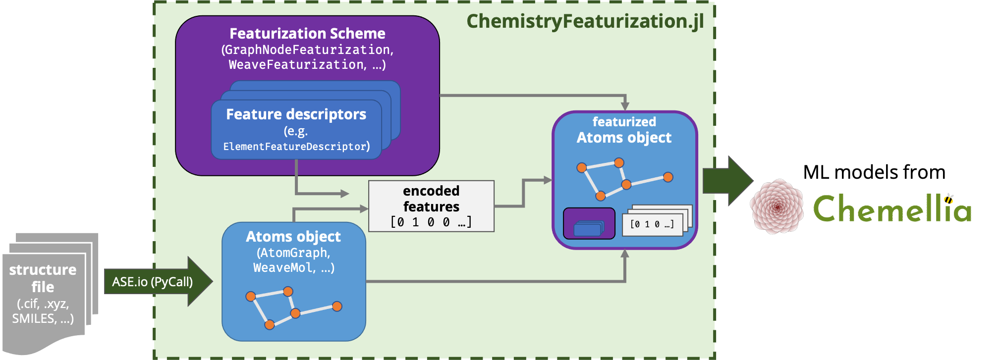

# ChemistryFeaturization.jl

*Data types and featurization schemes for Chemellia models and beyooond!*

ChemistryFeaturization.jl is meant to be a unified interface for translating atomic structures (molecules, crystals, etc.) into data structures and sets of features to be used in machine learning models provided by the Alchemy suite of packages, such as [AtomicGraphNets.jl](https://github.com/aced-differentiate/AtomicGraphNets.jl).

This package is in development as part of the [ACED project](https://www.cmu.edu/aced/), funded by ARPA-E DIFFERENTIATE and coordinated by a team from [Carnegie Mellon University](https://www.cmu.edu/), in collaboration with [Julia Computing](https://juliacomputing.com/), [Citrine Informatics](https://citrine.io/), and [MIT](https://web.mit.edu/). [Dr. Rachel Kurchin](https://rkurchin.github.io) is the lead developer.

## Purpose

This is intended to serve as a "helper package" of sorts for other packages that actually build the models, and NOT as a standalone tool (for instance, ChemistryFeaturization.jl it does not itself implement any models).

It provides flexible, modular data types and functions for starting from a "bare" atomic structure of a molecule or crystal, featurizing it with various tabulated or computed properties of its constituent atoms, bonds, etc., and encoding those features into a format appropriate to ingest into a machine learning model. Critically, it also provides functions for _inverting_ this process, i.e. decoding the featurization, as all necessary metadata is retained.

To learn more about the package, it would be good to start with the [Terminology/Philosophy](@ref) section to get a handle on the vocabulary as we use it, and also some insights about the design philosophy behind the package. Then go ahead and browse the sidebar for more!
