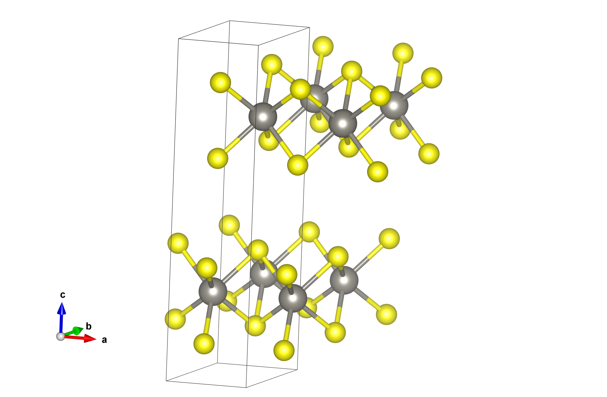

# Tutorial

```@contents
Pages = ["tutorial.md"]
Depth = 3
```

!!! note
    This tutorial is currently focused on [`AtomGraph`](@ref) objects, featurized using [`ElementFeatureDescriptor`](@ref)s in a [`GraphNodeFeaturization`](@ref), because these are the functionalities that are currently fully built, but we anticipate expanding it as more things are finished!

## Creating/reading in a structure
```@meta
DocTestSetup = quote
    using ChemistryFeaturization
end
```

### Create "from scratch"
We can build an `AtomGraph` "manually," by specifying an adjacency matrix and directly building the graph from that. Here I'll build a fictitious graph that's just an equiweighted triangle of carbon atoms:

```jldoctest
julia> adj_mat = Float32.([0 1 1; 1 0 1; 1 1 0]);

julia> triangle_C = AtomGraph(adj_mat, ["C", "C", "C"])
AtomGraph  with 3 nodes, 3 edges
	atoms: ["C", "C", "C"]
```
If you're working in an IDE that supports graphics output, you can also call `visualize(triangle_C)` to see the "ball-and-stick" graph.

### Reading from file
In a "real" application, you'll likely be reading structures from files such as .cif, .xyz, etc. Here, we'll read in the structure of WS<sub>2</sub>, downloaded from the [Materials Project](https://materialsproject.org):

```jldoctest WS2; setup=:(cd("./src/files/"))
julia> WS2 = AtomGraph("mp-224.cif")
AtomGraph mp-224 with 6 nodes, 9 edges
	atoms: ["W", "W", "S", "S", "S", "S"]

```
The graph is automatically assigned an `id` based on the filename it was read from, but you can pass a value to override this and name it something else.

If you visualize this graph as above, you'll notice that it has two disconnected components. This isn't too surprising if we look at the 3D structure of this compound:

It's a two-dimensional material with two formula units per unit cell! Another way to see the disconnectedness of the graph is to index into the adjacency matrix in a particularly illustrative order:

```jldoctest WS2
julia> WS2.graph[[1,4,6,2,3,5]].weights
6×6 SparseArrays.SparseMatrixCSC{Float64, Int64} with 18 stored entries:
 1.0     0.9732   0.9732    ⋅       ⋅        ⋅ 
 0.9732  1.0      0.17143   ⋅       ⋅        ⋅ 
 0.9732  0.17143  1.0       ⋅       ⋅        ⋅ 
  ⋅       ⋅        ⋅       1.0     0.9732   0.9732
  ⋅       ⋅        ⋅       0.9732  1.0      0.17143
  ⋅       ⋅        ⋅       0.9732  0.17143  1.0

```

However, we have options in how we actually construct the graph. The default option is based on the scheme from [the original cgcnn.py implementation](https://github.com/txie-93/cgcnn), which essentially involves setting a maximum neighbor distance and a maximum number of neighbors. However, in contrast to that implementation, we construct weighted graphs (with the user having an ability to specify the weight decay function with separation distance; it defaults to inverse-square).

An arguably more physical way to construct neighbor lists and graphs is by doing a [Voronoi partition](https://en.wikipedia.org/wiki/Voronoi_diagram) of the atomic coordinates. In this scheme, the neighbor list of an atom is any atom with which its Voronoi polyhedron shares a face, and the edge weights can be determined using the areas of the faces. Let's try that with our WS<sub>2</sub> structure...

```jldoctest WS2v
julia> WS2_v = AtomGraph(joinpath("..", "files", "mp-224.cif"), use_voronoi=true);

julia> WS2_v.graph[[1,4,6,2,3,5]].weights
6×6 SparseArrays.SparseMatrixCSC{Float64, Int64} with 22 stored entries:
 0.371678  0.970447   0.970447    ⋅         ⋅          ⋅ 
 0.970447  1.0        0.0231855   ⋅         ⋅         0.31894
 0.970447  0.0231855  1.0         ⋅        0.31894     ⋅ 
  ⋅         ⋅          ⋅         0.371678  0.970447   0.970447
  ⋅         ⋅         0.31894    0.970447  1.0        0.0231855
  ⋅        0.31894     ⋅         0.970447  0.0231855  1.0
```

(You can, of course, also visualize this one in your IDE)

### Batch processing
One final note for this section: the `AtomGraph` constructor broadcasts! So if you have a directory full of structure files (say, `strucs/`), you can get a list of `AtomGraph` objects by:
```
ags = AtomGraph.(readdir("strucs/", join=true))
```

## Building feature descriptors
What types of features of our structure do we want to encode in our graph? Let's keep things simple for now and consider features that can be encoded only by knowing the elemental identity of a given atom (node in our graph). The package includes a bunch of built-in data, and you can also provide your own for features we haven't included!

We'll do a demonstration with a couple of built-in element features, and one custom one...
```jldoctest fzn; setup=:(cd("../../"))
julia> block = ElementFeatureDescriptor("Block") # categorical feature denoting s-, p-, d-, or f-block elements
ElementFeature Block:
   categorical: true
   encoded length: 4
```

## Building a featurization

## Featurizing structures

## Decoding encoded features